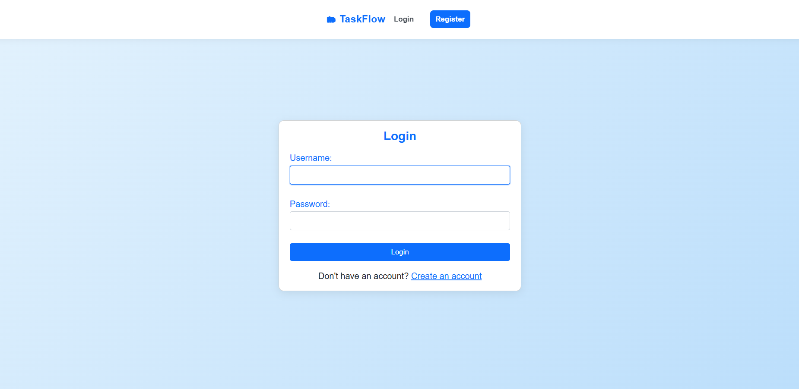
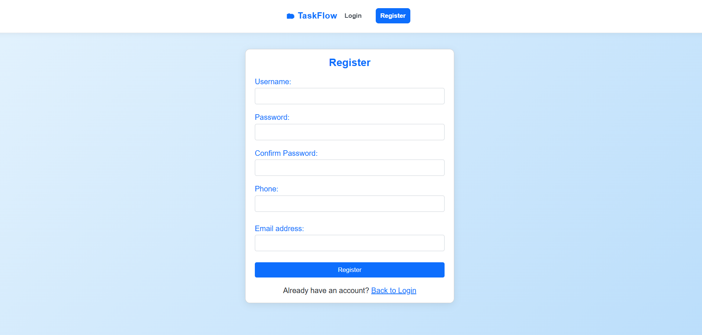
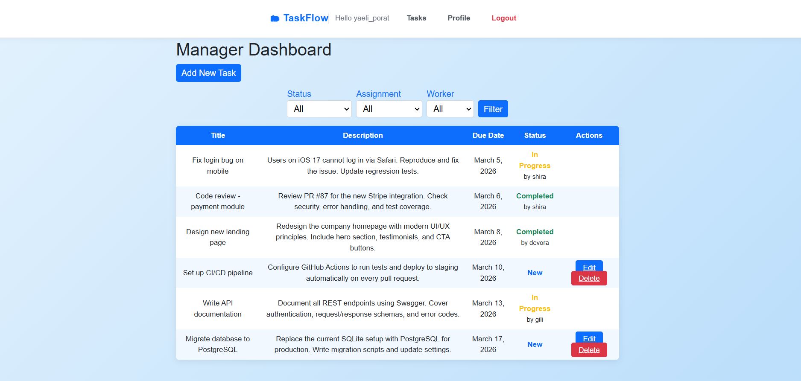
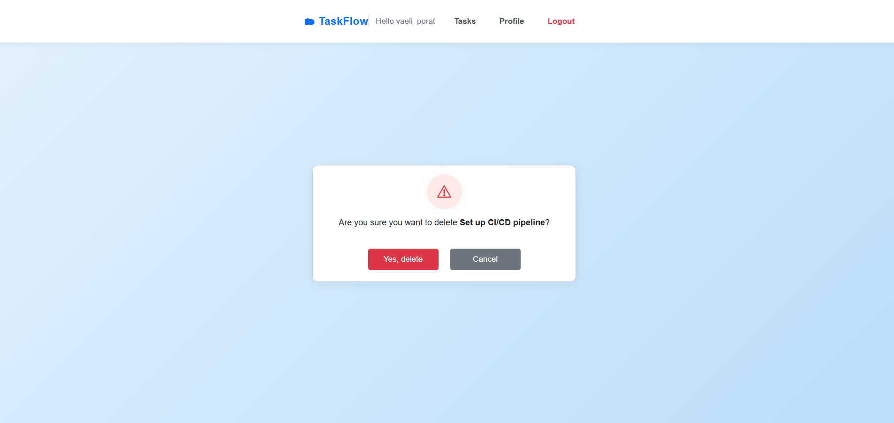
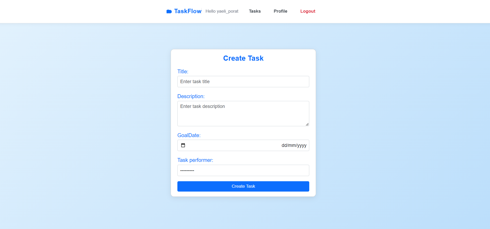
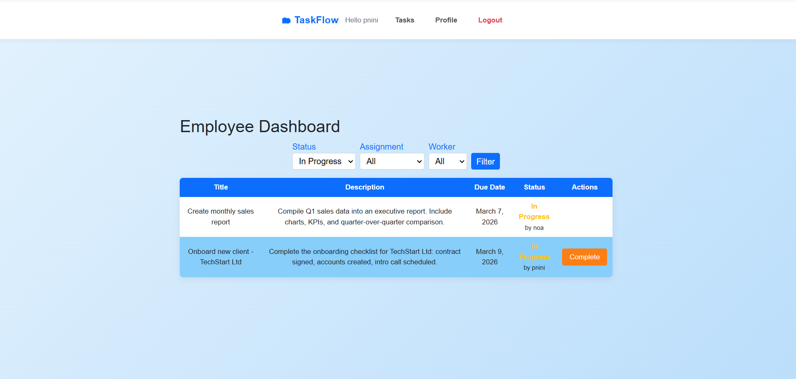
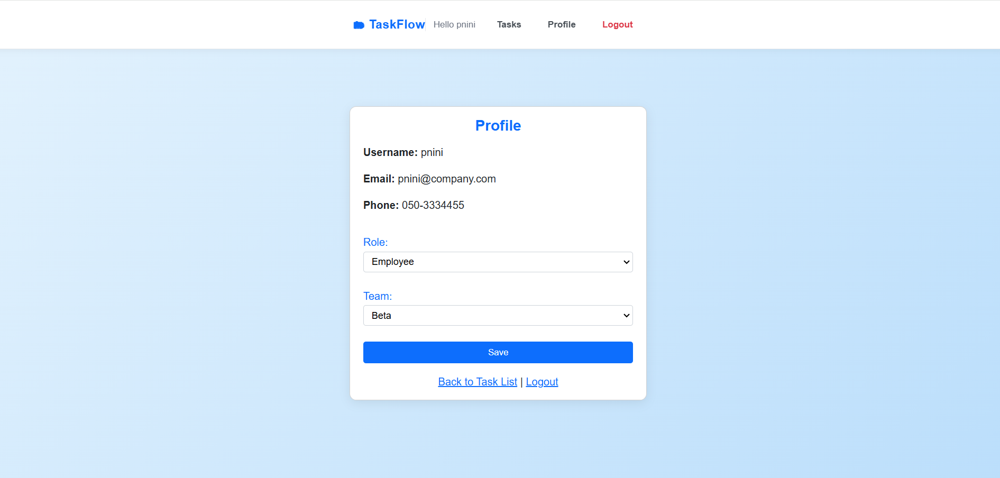

#  Task Manager

**A web-based task management system built with Django**  
Managers create and assign tasks — employees take and complete them.
<div>
  


</div>

This system bridges the gap between management and execution. It provides managers with full visibility into their team's workload while offering employees a streamlined interface to claim and complete tasks without administrative overhead.


<p align="center">
  
</p>

##  Table of Contents
- [Features](#features)
- [Core Logic & Architecture](#core-logic--architecture)
- [Tech Stack](#tech-stack)
- [Getting Started](#getting-started)
- [How It Works](#how-it-works)
- [Screenshots](#screenshots)
- [Documents](#documents)

---

##  Features

-  **Authentication** – Register, login, and logout
-  **Two roles** – Manager and Employee with different permissions
-  **Task management** – Create, edit, delete, and assign tasks
-  **Task lifecycle** – `New` → `In Progress` → `Completed`
-  **Filtering** – Filter by status, assignment, and worker
-  **Profile page** – View and update personal info
-  **Team-based** – Each user only sees their own team's tasks

---
##  Core Logic & Architecture

### Role-Based Access Control (RBAC)
The application distinguishes between roles using a custom `userStatus` field in the User model:
* **Managers:** Can perform full CRUD operations on tasks and assign them to specific team members.
* **Employees:** Can only "Claim" (Take) unassigned tasks and move them through the lifecycle (`New` → `In Progress` → `Completed`).

### Data Integrity & Scoping
* **Team Isolation:** A middleware-like logic in the Views ensures that users (both Managers and Employees) can only interact with tasks belonging to their assigned `Team`.
* **State Management:** Task status transitions are handled via specific POST actions to prevent unauthorized state changes.
* 
---

##  Tech Stack

| Layer | Technology |
|-------|-----------|
| Backend | Python · Django 6.0 |
| Frontend | HTML · CSS · Bootstrap 5 |
| Database | SQLite |
| Auth | Django Custom User |
| Forms | django-widget-tweaks |
| Environment | python-dotenv |


---

##  Getting Started

### Prerequisites

- Python 3.10+
- pip

### Installation

**1. Clone the repository**
```bash
git clone https://github.com/yaeli6858/python-task-management.git
cd task-manager
```

**2. Create and activate a virtual environment**
```bash
# Windows
python -m venv venv
venv\Scripts\activate

# Mac / Linux
python -m venv venv
source venv/bin/activate
```

**3. Install dependencies**
```bash
pip install -r requirements.txt
```
**4. Configure Environment** Create a `.env` file in the root directory and add your configurations:
```bash
SECRET_KEY=your_django_secret_key
DEBUG=True

**5. Apply migrations**
```bash
python manage.py migrate
```

**6. Load sample data** _(optional – for demo/screenshots)_
```bash
python seed_data.py
```

**7. Run the development server**
```bash
python manage.py runserver
```

Open your browser at: **http://127.0.0.1:8000** 

---

##  Demo Accounts

After running `seed_data.py`:

| Role | Username | Password | Team |
|------|----------|----------|------|
|  Manager | `yaeli_porat` | `password123` | Alpha |
|  Manager | `tamar_winer` | `password123` | Beta |
|  Employee | `devora` | `password123` | Alpha |
|  Employee | `shira` | `password123` | Alpha |
|  Employee | `gili` | `password123` | Alpha |
|  Employee | `pnini` | `password123` | Beta |
|  Employee | `noa` | `password123` | Beta |

---

##  Project Structure

```
task-manager/
├── task_manager/         # Project settings and URLs
│   ├── settings.py
│   └── urls.py
├── tasks/                # Main app
│   ├── models.py         # CustomUser, Team, Task
│   ├── views.py          # All views
│   ├── forms.py          # Task and user forms
│   ├── urls.py           # App routes
│   ├── admin.py
│   └── templates/
│       ├── accounts/     # Login, Register
│       └── tasks/        # Task list, create, update, delete, profile
├── static/
│   └── css/project.css
├── seed_data.py          # Demo data loader
├── manage.py
└── requirements.txt
```
##  Architecture & Security
### Data Models
* **CustomUser**: Extends Django's `AbstractUser` to include specialized roles (`userStatus`: 0 = Manager, 1 = Employee) and team associations.
* **Team**: A grouping entity that facilitates "Team Isolation" logic, ensuring data privacy between different departments.
* **Task**: Features a dynamic state machine (`New` -> `In Progress` -> `Completed`) and handles assignments via ForeignKeys.

### Security & Best Practices
* **Environment Safety**: Leverages `python-dotenv` to decouple sensitive configurations (like `SECRET_KEY`) from the codebase.
* **UI Logic**: Utilizes `django-widget-tweaks` to maintain clean templates while injecting Bootstrap 5 classes dynamically into Django-native forms.
* **Role-Based Access Control (RBAC)**: Implements server-side validation to ensure employees cannot access manager-only views (Create/Edit/Delete).

---

##  How It Works

###  Manager Flow
1. Log in as a manager
2. View all tasks in your team with status indicators
3. Create a new task and optionally assign it to an employee
4. Edit or delete unassigned tasks

###  Employee Flow
1. Log in as an employee
2. Browse available (unassigned) tasks in your team
3. Click **"Take Task"** to claim a task → status becomes `In Progress`
4. Click **"Complete"** when finished → status becomes `Completed`

---

##  Dependencies

```
Django==6.0.2
django-widget-tweaks==1.5.1
python-dotenv==1.2.2
asgiref==3.11.1
sqlparse==0.5.5
tzdata==2025.3
```
---

##  Screenshots

###  Authentication Page



###  Manager Dashboard

##  Update Task


##  Delete  Task




##  Create New Task
 

###  Employee View
 

###  Profile Page
 

---
##  Documentation & Development Process
The development of this project followed a structured **Software Development Life Cycle (SDLC)**. Each phase was documented to ensure data integrity, clear business logic, and a seamless user experience.

### 1. [System Characterization & Specs](documents/progress.docx)
*Focuses on the foundation and organizational rules of the application.*
* **Role-Based Permissions**: Defined the distinct authorities for **Managers** (full CRUD, team oversight) and **Employees** (task claiming and progress updates).
* **Entity Mapping**: Detailed the required fields for **Users**, **Tasks**, and **Teams** to ensure a robust database schema.
* **Organizational Structure**: Established "Team Isolation" logic, ensuring no data overlap between different departments.

### 2. [Functional Requirements & Logic](documents/functions.docx)
*Outlines the backend behavior and automated business workflows.*
* **Task State Machine**: Defined automated status transitions, such as moving a task to `In Progress` immediately upon being claimed by a worker.
* **Access Control Lists (ACL)**: Mapped out restrictions, such as preventing users without an assigned team or role from accessing the task dashboard.
* **Admin Operations**: Reserved high-level management (Team creation/deletion) for administrative users only.

### 3. [UI/UX Mapping & User Flows](documents/features.docx)
*Bridged the gap between backend views and frontend templates.*
* **Template Architecture**: Detailed documentation for every HTML view, including Authentication, Profile management, and the Task Dashboard.
* **Navigation Flow**: Mapped the user journey, such as the redirection logic after registration or task creation.
* **Interactive Elements**: Mapped all UI components (buttons, filters, forms) to their respective Django POST/GET actions.

---
##  Roadmap & Future Enhancements
- [ ] **Email Notifications**: Automatic alerts for managers when a task is marked as `Completed`.
- [ ] **Analytics Dashboard**: Integrated charts (Chart.js) to track team performance and task completion rates.
- [ ] **REST API**: Implementing Django REST Framework to support mobile or external integrations.
- [ ] **PostgreSQL Migration**: Transitioning from SQLite to a production-ready database.
---
##  License

This project is for educational purposes.

